Faveo Helpdesk – Demo
=====================

##**Introducción**

*Faveo Servicio de Asistencia proporciona a las empresas un sistema de ayuda
automatizada para gestionar la atención al cliente.*

*La palabra Faveo proviene del latín que significa estar favorable. Esta
realmente destaca la visión y el alcance, así como la funcionalidad del
producto, lo que es Faveo.*

*Está específicamente diseñado para satisfacer las necesidades de las nuevas
empresas y las PYMES, ya que les permite contar con un sistema de soporte basado
en tiquetes de última tecnología.*

*Dispone de 4 versiones que van desde su versión “free open source” a la versión
premium de pago:*

-   *Helpdesk – Perpetual*

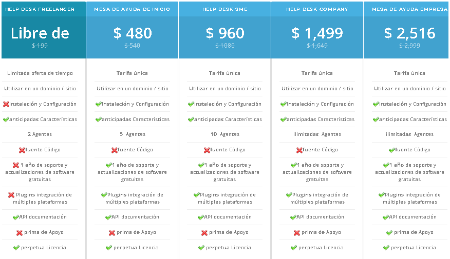

-   *Servicedesk – Perpetual*

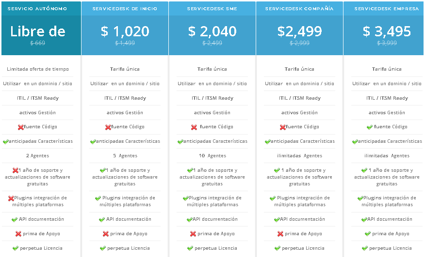

-   *Helpdesk – Recurring*

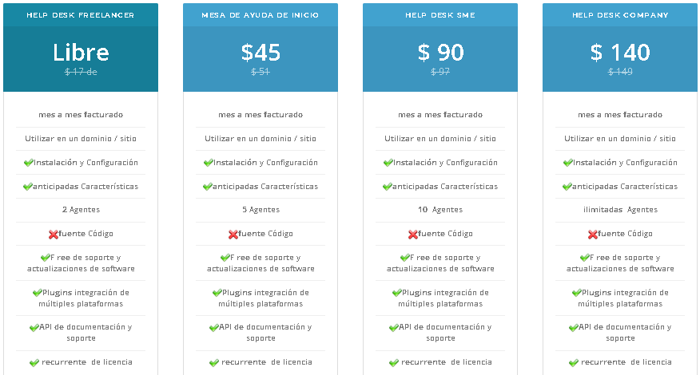

-   *Helpdesk - Recurring*

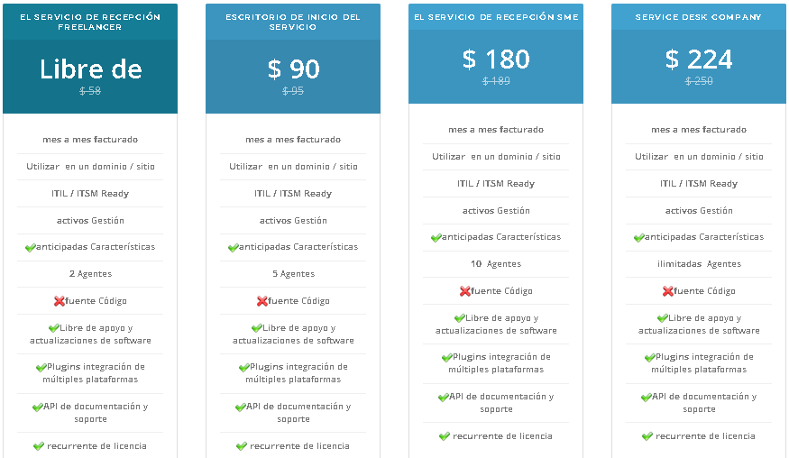

##**Instalación**

*En mi caso hago uso de la herramienta demo online ya que me fue imposible
instalar la versión gratuita.*

*Dicha herramienta nos proporciona 3 ámbitos (Administrador,Cliente,Agente) con
los que poder observar cómo funciona la aplicación.*

*Herramienta :* <https://www.faveohelpdesk.com/demostracion/?lang=es>

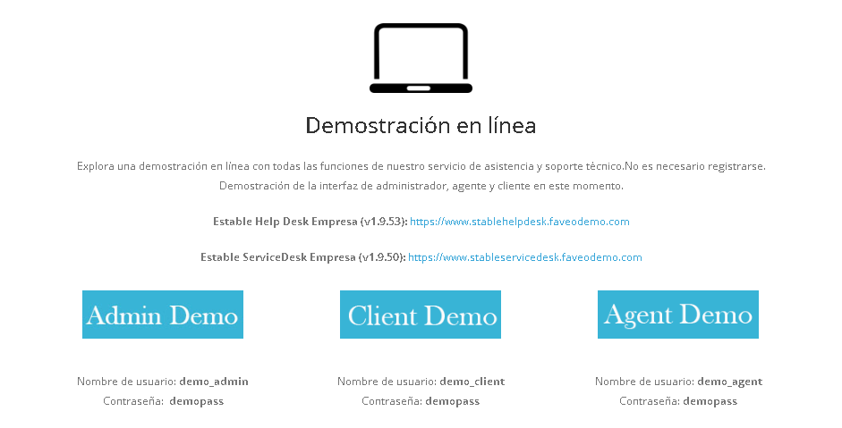

*Si llegáramos a instalar la herramienta ya sea la versión gratuita o las
versiones de pago, debemos de tener en cuenta unos requisitos para ello que son
los siguientes:*

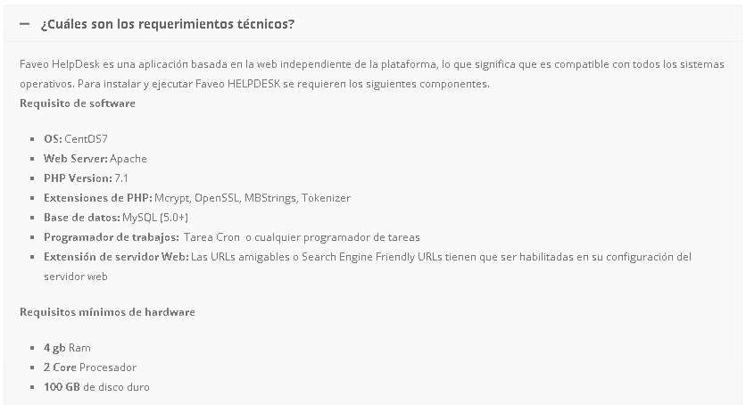

##**Uso de la herramienta**

*Como hemos nombrado en el apartado anterior, disponemos de 3 ámbitos en la demo
online. Primero hablare sobre el ámbito del agente:*

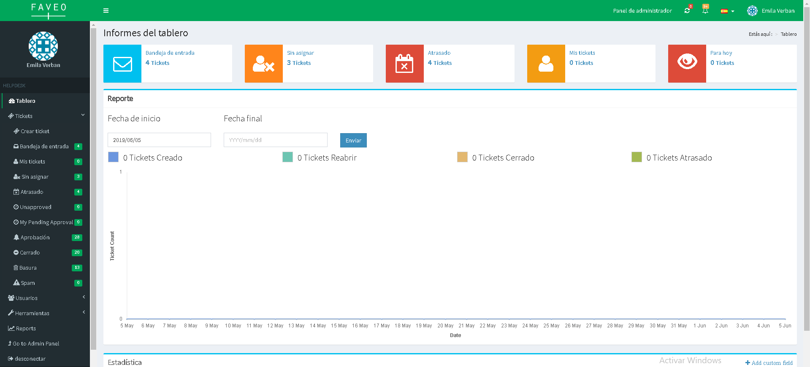

*Desde el panel de agente podemos hacer uso de la interfaz tal y como la vemos
en la captura. Nos informa sobre cuantos tickets hay nuevos, sin asignar,
atrasados, tickets que tengo asignados y cuantos tickets hay programados para
solucionar hoy.*

*También dispone de una gráfica donde podemos hacer un seguimiento de los
tickets creados, solucionados y atrasados desde el margen de fechas que
indiquemos.*

*En el menú lateral izquierdo tenemos varias pestañas a comentar.*

*Tickets*

*Dentro de esta pestaña podemos hacer cosas como crear tickets, ver la bandeja
de entrada, ver los tickets asignados/no asignados, los tickets retrasados,
posibilidad de aprobar o no un ticket, ver los tickets cerrados o los marcados
como spam.*

*Dos parámetros que son los fundamentales de esta pestaña son:*

-   *Creación de un ticket.*

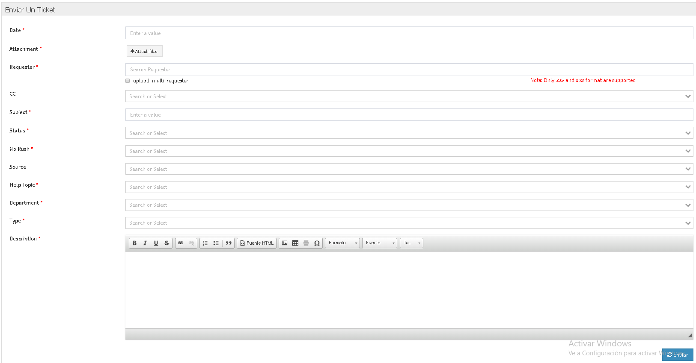

-   *Bandeja de entrada.*

*Desde este apartado podemos seleccionar los tickets y realizar la mayoría de
las acciones nombradas anteriormente como son (asignar,cerrar,marcar como
spam,etc).*

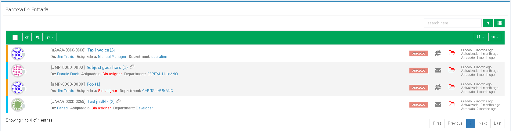

*Usuarios*

*Dentro de esta pestaña podemos hacer dos cosas. La primera es la creación y
almacenamiento de usuarios de los que podemos recibir tickets. De los usuarios
podemos almacenar datos como son el correo electrónico e incluso el teléfono
móvil ya que existe la herramienta de Faveo para versiones móviles.*

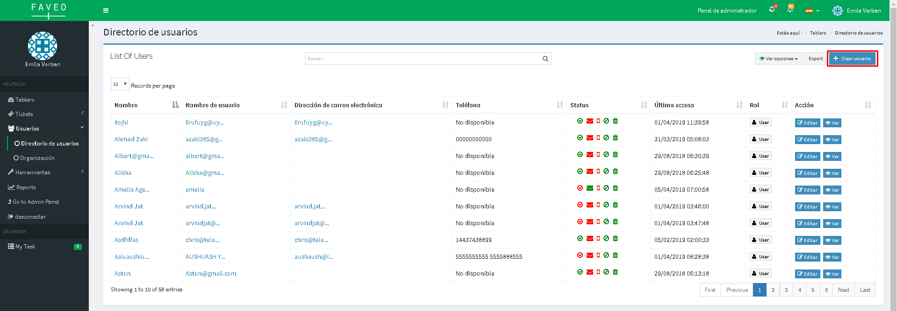

*Lo segundo que podemos hacer va con respecto a las organizaciones. En dicha
pestaña podemos crear organizaciones donde asignar los clientes que creamos para
poder identificar el sector desde donde el cliente nos solicita a través del
ticket.*

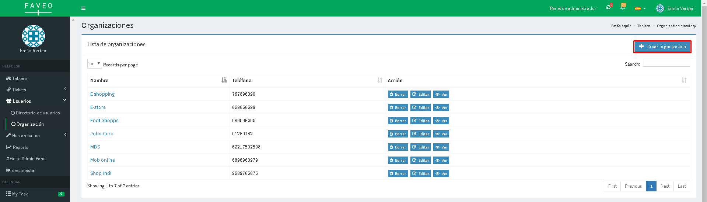

*Seleccionamos una de las organizaciones para observar el perfil de la misma.
Podemos ver que dicha organización tiene a 2 clientes asignados a la misma y
también podemos observar que uno de los clientes llamado Donald Duck tiene un
ticket abierto en la parte inferior de la captura.*

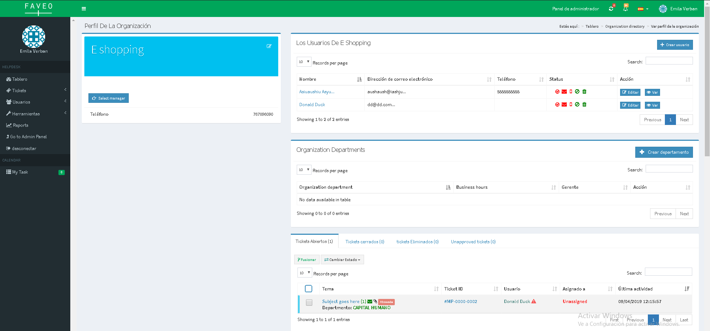

*Herramientas*

*En este apartado podemos realizar varias acciones. La primera es la posibilidad
de crear respuestas predefinidas. Con esta opción podemos hacer que por ejemplo
cuando un cliente envíe su ticket, este, reciba un correo generado
automáticamente diciendo que el ticket se ha generado correctamente y que este
está bajo supervisión.*

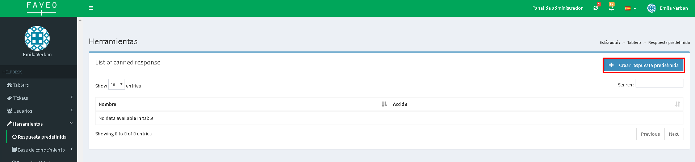

*Otra opción que tiene es la posibilidad de almacenar información sobre el
dominio en el trabajamos con la herramienta Faveo. En la demo online se trabajo
sobre una tienda de moda. En dicha base de datos sobre la misma podemos
introducir y guardar información como (categorías,artículos ,páginas,etc).*

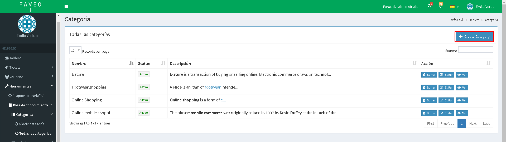

*Lo último que podemos hacer en este apartado es la creación de tickets
programados indicando parámetros como son el intervalo, el inicio y cuando
finaliza. Esta opción es de gran utilidad ya que puede ahorrar tiempo y esfuerzo
de crear mismas entradas a intervalos regulares.*

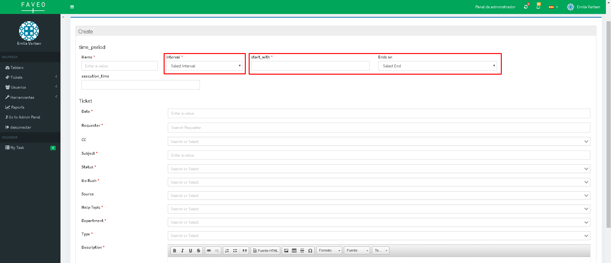

*Reportes*

*En esta sección podremos llevar un seguimiento de nuestro servicio técnico. En
él podemos monitorizar el rendimiento del equipo técnico ya sea a nivel
individual como a nivel de departamento o de equipo, podremos observar el nivel
de satisfacción del cliente respecto a la respuesta obtenida, descargar la
actividad de reportes para un examen exhaustivo del servicio técnico y muchas
cosas más.*

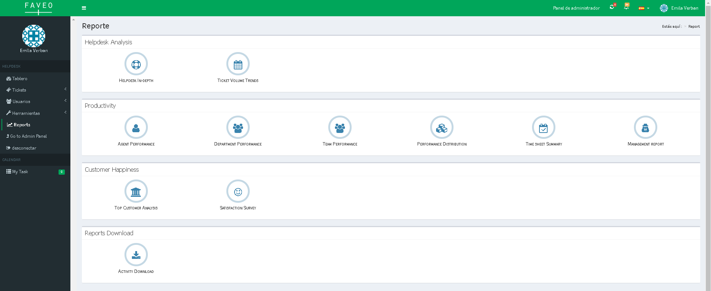

*Ámbito de administrador:*

*Sobre el panel de administrador solo hablaré sobre opciones que le caracterizan
ya que comparte la mayoría de cosas con el agente.*

*Personal*

*En este apartado podemos encontrar la opción de “Agentes”. Este, permite añadir
a los usuarios del servicio técnico del que forman parte. Estos usuarios serán
los encargados de recibir los tickets y dependiendo del departamento del que
provenga se le asignará a uno u a otro.*

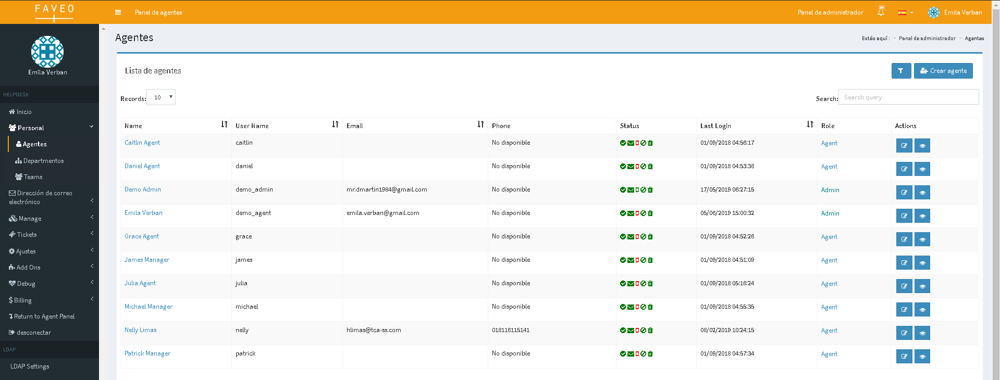

*Correo electrónico*

*Aquí podemos configurar cosas como el correo electrónico de cada departamento.
En la demo online solo se encuentra configurado el correo para el departamento
de soporte.*

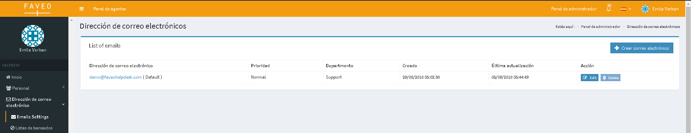

*Otra cosa que podemos hacer es generar una “black-list” ya que podemos crear
una lista de correos electrónicos baneados.*

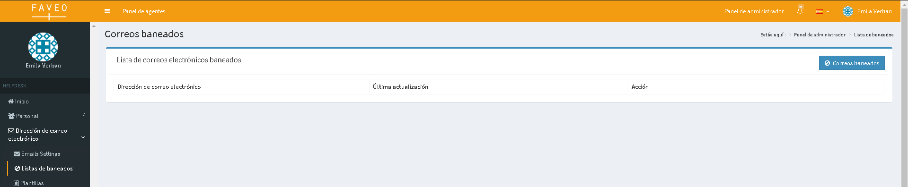

*Tickets*

*Sobre los tickets destacar que desde el panel de administrador podemos
personalizar el mismo a gusto del mismo. Podemos generar alertas/avisos, asignar
tickets automáticamente, etc. A demás dispone de una opción llamada Fuentes
donde podremos indicar accesibilidad al cliente que use el sistema de tickets.*

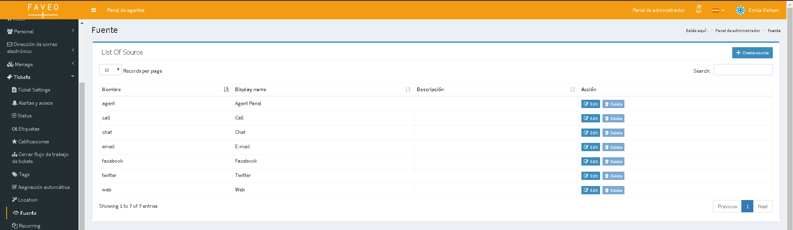

*Sistema*

*En este parámetro podemos hacer absolutamente de todo respecto al sistema.
Nombraré un par de apartados como por ejemplo la posibilidad de configurar los
ajustes del sistema (Nombre,URL,Zona horaria,etc).*

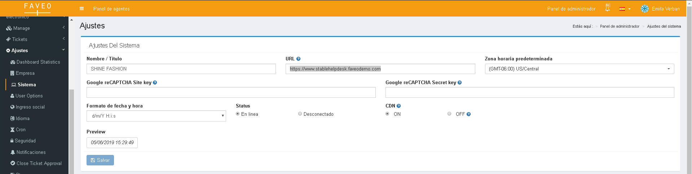

*Incluso modificar los parámetros respecto a la compañía.*

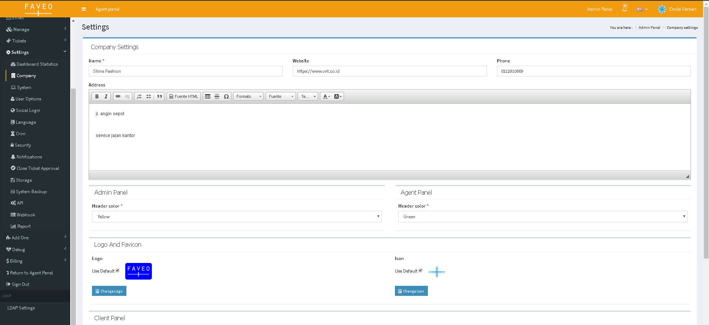

*La configuración del apartado Seguridad nos permite tener un control sobre la
compañía. Por ejemplo, podemos indicar que el máximo intento de inicio de sesión
sea de [X] veces, que la sesión dure [X] minutos, etc.*

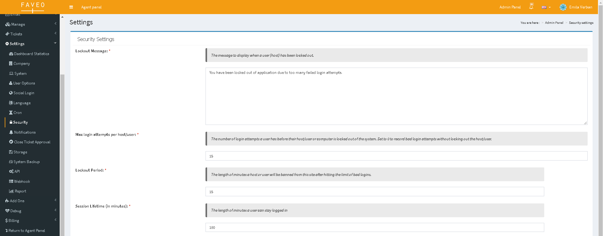

*AddOns*

*La herramienta Faveo nos permite añadir plugins e incluso módulos al servicio
de tickets. La demo online viene con plugins como son para el calendario, para
la integración de chat, para autentificación mediante LDAP, etc.*

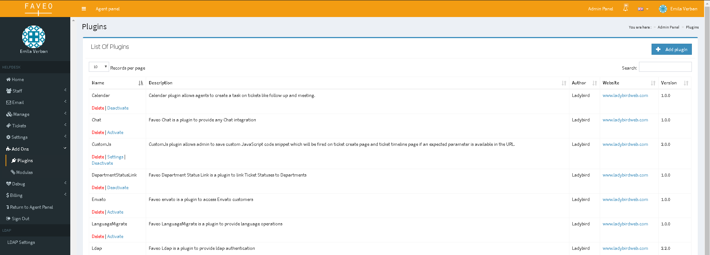

*También dispone de los siguientes módulos que permiten un mejor seguimiento del
servicio técnico.*

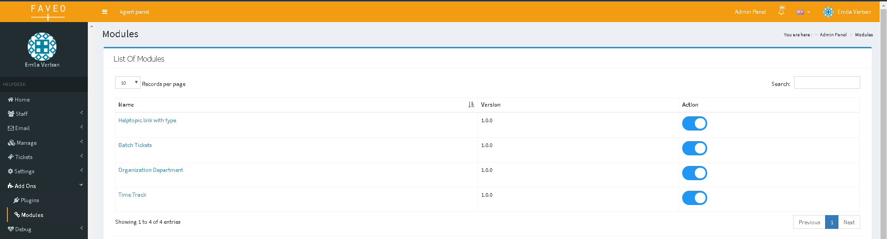

*Método de pago*

*Podemos configurar desde la misma herramienta los métodos de pagos posibles
para la compañía. En el caso de la demo online al tratarse de una tienda de
moda. Permite el pago mediante efectivo, por transferencia bancaria e incluso
mediante PayPal.*

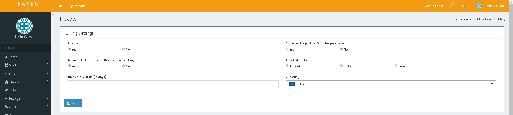

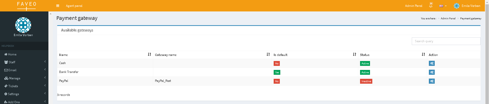

*Ámbito de cliente:*

*Podemos observar que es lo que vería el cliente de la demo online. Una simple
página de moda online donde podremos realizar la creación de un ticket si
tenemos algún tipo de compromiso.*

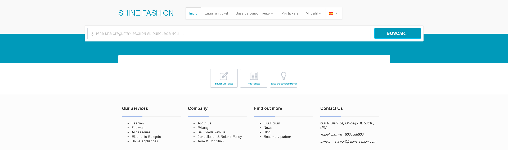

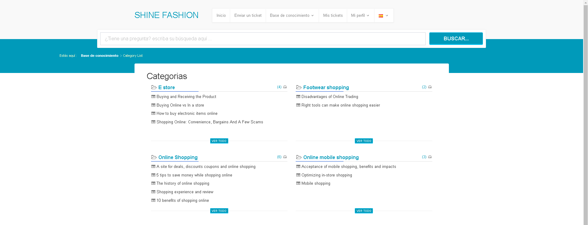

*A la hora de enviar el ticket, observamos que disponemos de un formulario a
rellenar indicando el problema o duda que presenta el cliente. Observamos que
hay campos indicado con “\*” ya que son obligatorios a rellenar para facilitar
la tarea al servicio técnico.*

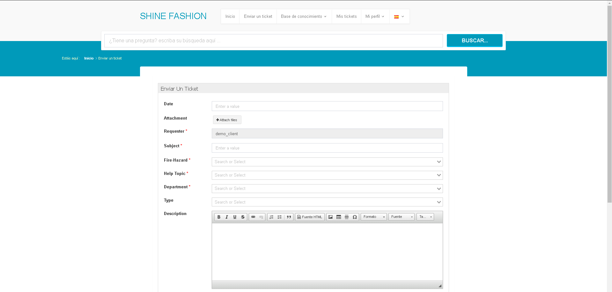

*Una vez enviado el ticket, los agentes del cuerpo técnico, recibirán el mismo.
Una vez recibido, el administrador o ellos mismos se lo asignarán para otorgarle
ayuda cuanto antes. Una vez el usuario encargado de la resolución del problema
resuelva el mismo, este, concluirá la incidencia.*

##**Conclusión**

-   *Es una herramienta bastante potente y completa.*

-   *Facilidad de uso tanto para el cliente como para el servicio técnico.*

-   *Capacidad de monitorizar rendimiento del equipo técnico.*

-   *Posibilidad de personalización de la herramienta a gusto de la empresa que
    lleve el servicio técnico.*

-   *Como desventajas le veo la dificultad para la instalación de la versión
    gratuita.*
